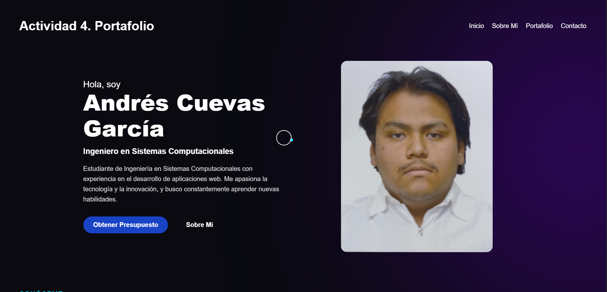
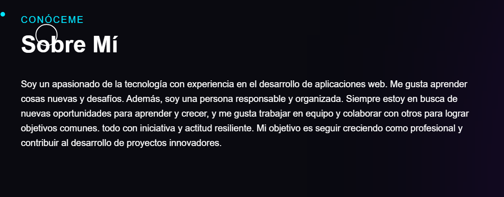
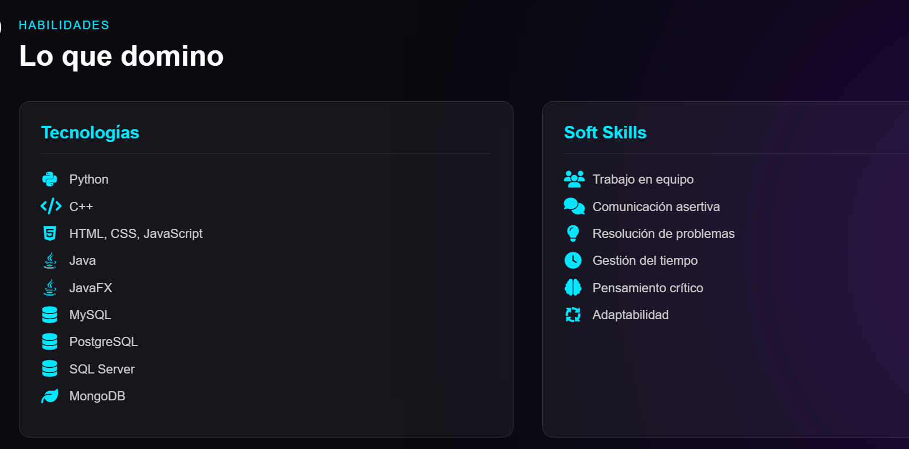
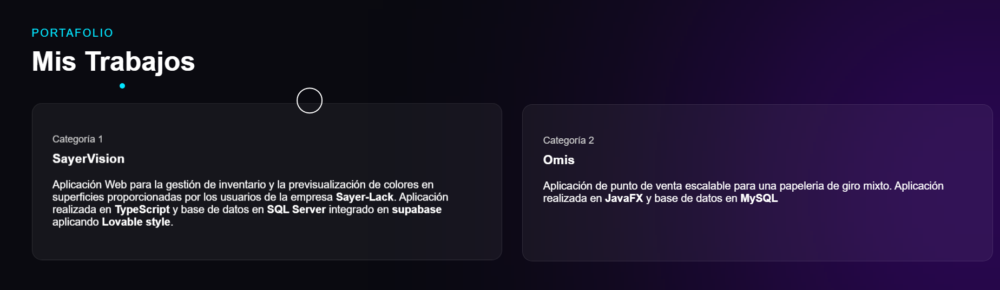
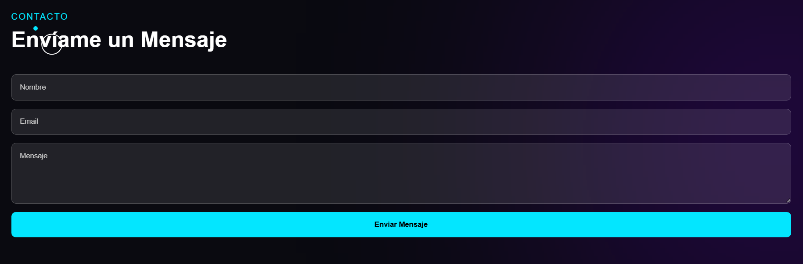

  

### Ingenieria en sistemas computacionales

 

#### Programación web

#### Tema 2

 

#### Actividad 4

# Portafolio Web con Bootstrap o Tailwind

   

**Docente:** 
Ing. Adelina Martínez Nieto

  

**Estudiantes:** 
Cuevas Garcia Andrés

      

Oaxaca de Juarez, Oaxaca.
  
11 de Julio de 2026

## Descripción del Proyecto

Este proyecto consiste en un portafolio web personal, construido utilizando **HTML, CSS y JavaScript** (Vanilla), asegurando que cumple con los requerimientos técnicos y de diseño solicitados en la rúbrica.

Se empleó una plantilla basada en el **Portafolio de Sadee y Vinod Jangid**, la cual fue adaptada para incluir una estética moderna y ordenada.

Portafolio de Vinod Jangid
GitHub: https://github.com/vinodjangid07/vinodjangid07.github.io
Preview: https://v1.vinodjangid.site/

Portafolio de Sadee
GitHub: https://github.com/codewithsadee/portfolio
Preview: https://codewithsadee.github.io/portfolio/

### Secciones del Portafolio:
- **Inicio (Hero):** Sección principal que incluye una presentación breve, mi rol actual, botones de llamado a la acción (Call to Action) para contacto y una fotografía de perfil formal.
- **Sobre Mí:** Breve descripción personal sobre mis metas, mi forma de trabajo y características profesionales.
- **Habilidades (Lo que domino):** Dividida en dos columnas:
  - *Tecnologías:* Lenguajes y herramientas de software (Python, C++, HTML, CSS, JS, SQL Server, MongoDB, etc.).
  - *Soft Skills:* Habilidades interpersonales (Trabajo en equipo, Adaptabilidad, Pensamiento crítico, etc.).
- **Mis Trabajos (Portafolio):** Muestra los proyectos en los que he trabajado, incluyendo descripciones y tecnologías utilizadas (SayerVision, Omis).
- **Contacto:** Formulario básico para solicitar presupuestos o información.

## Proceso de Creación

Para el desarrollo del portafolio, se siguieron estos pasos:
1. **Estructuración del Repositorio:** Se crearon y organizaron las carpetas de recursos (`css/`, `js/` e `img/`) para asegurar el cumplimiento de la rúbrica.
2. **Estructura HTML:** A partir de la plantilla seleccionada, construimos el esqueleto principal del documento en `index.html`.
3. **Estilos e Interfaz:** Modificamos el diseño general usando flexbox y layouts modernos para que la vista sea totalmente responsiva. Todos los estilos, incluidos los efectos del cursor interactivo, fueron unificados en `css/portafolio.css`.
4. **Iconografía:** Se integró la librería *FontAwesome* para incorporar íconos descriptivos en las áreas de tecnologías y soft skills.
5. **Interactividad:** Se implementó JavaScript puro en `js/portafolio.js` para animar el comportamiento del cursor y el diseño general de fondo.

## Capturas de Pantalla

Primer seccion de la pagina (Presentación)

Segunda seccion (Sobre Mí)

Tercer seccion (Habilidades)

Cuarta seccion (Mis Proyectos)

Quinta seccion (Contacto)

